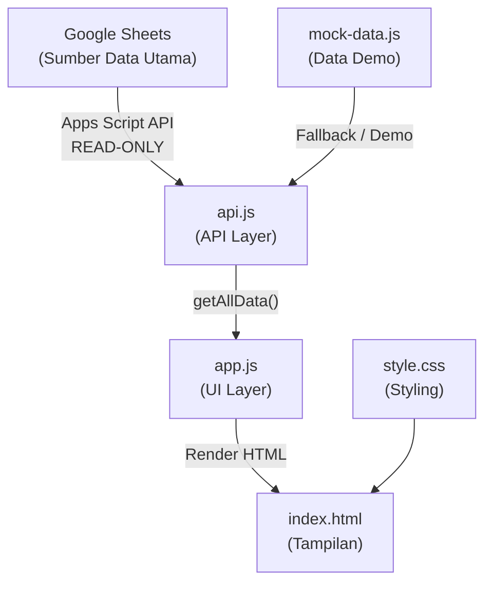

# 📖 Panduan Maintenance & Penggantian Google Sheets
## PSMURO Monitoring Dashboard

---

## 1. Arsitektur & Alur Data



### Urutan Loading File
```
index.html
  ├── style.css          ← CSS dimuat pertama
  ├── data/mock-data.js  ← Mock data dimuat ke window.PSMURO_MOCK
  ├── api/api.js         ← API layer (baca dari GSheets ATAU mock)
  └── app.js             ← Logic UI, filter, render tabel
```

---

## 2. Penjelasan Setiap File

---

### 📁 `data/mock-data.js` — Data Demo / Fallback

**Fungsi:** Menyimpan data dummy untuk development/demo. Digunakan saat Google Sheets tidak tersedia atau `USE_REAL_API = false`.

#### Bagian-bagian:

| Section | Variabel | Fungsi |
|---------|----------|--------|
| 1. Assistants | `mockAssistants` | Daftar 8 asisten demo dengan `id`, `name`, `domicile`, `job`, `uids[]` |
| 1b. Data UID | `mockDataUID` | **Sumber utama** — record UID individual yang merepresentasikan sheet "Data UID" di GSheets |
| 2. Attendance | `mockAttendance` | Record kehadiran demo (shift, mutu, tanggal) |
| 3. Activity Codes | `mockActivityCodes` | Kode aktivitas (0=Tidak Hadir, 1=Piket, 2=Rapat, dst) |
| 4. Labs | `mockLabs` | Informasi lab (LAB_D=Depok, LAB_J=Kalimalang, LAB_K=Karawaci) |
| 5. Jobs | `mockJobs` | Informasi job (1=PSMURO, 2=DASAR-MENENGAH, 3=LANJUT) |
| 6. Shifts | `mockShifts` | Informasi shift (A=07.30-10.00, B=10.00-12.30, dst) |
| 7. Honor Config | `mockHonorConfig` | Konfigurasi honor (Rp2.900 per shift point) |
| 8. Helpers | `getLabName()`, `getJobName()`, dll | Fungsi bantu lookup |
| 9. Export | `window.PSMURO_MOCK` | Semua data di-export ke global window |

#### Kapan perlu diubah:
- ❌ **Tidak perlu diubah** jika hanya mengganti Google Sheets
- ✏️ Ubah jika ingin mengubah data demo/fallback

---

### 📁 `api/api.js` — API Layer (Jembatan Data)

**Fungsi:** Membaca data dari Google Sheets API atau mock data, lalu mengolahnya menjadi format yang siap dipakai oleh `app.js`.

#### Bagian-bagian:

##### ⚙️ CONFIG (Baris 21-32)
```javascript
const CONFIG = {
    USE_REAL_API: true,        // true = Google Sheets, false = mock data
    REAL_API_URL: "https://script.google.com/macros/s/..../exec",
    CACHE_DURATION: 60 * 1000  // 60 detik
};
```

> [!IMPORTANT]
> **Untuk mengganti Google Sheets**, ubah nilai `REAL_API_URL` di sini.

##### 📊 MASTER DATA (Baris 57-101)
Lookup table yang digunakan untuk konversi kode:
- `ACTIVITY_CODES` — Kode aktivitas → nama
- `LABS` — Kode lab → nama lab
- `JOBS` — Kode job → nama job (1="PSMURO", 2="DASAR-MENENGAH", 3="LANJUT")
- `SHIFTS` — Kode shift → jam
- `HONOR_CONFIG` — Konfigurasi honor

##### 🔄 normalizeAttendanceRow() (Baris ~108-162)
Mengubah satu baris dari Google Sheets menjadi format standar:
```
Row GSheets → { id, date, uid, assistantName, assistantId, teachingLocation, domicile, job, shift1-5, mutu1-5, totalShift, status, access }
```

##### 👥 buildAssistants() (Baris ~253-369) — FUNGSI KUNCI
Ini adalah **fungsi paling penting**. Mengolah Data UID menjadi daftar asisten:

```
Data UID (per-record) → Grouped by Nama → Array asisten unik
```

**Logika:**
1. Loop semua record Data UID
2. Untuk setiap record, ambil `Name` dan `UID`
3. Jika nama sudah ada di Map → **tambahkan UID ke array `uids[]`** (gabung)
4. Jika nama belum ada → buat entry baru
5. Default Job = `"1"` (PSMURO)
6. Loop semua attendance → rekonsiliasi totalShift, totalMutu
7. Return array asisten unik

**Contoh:**
```
Input Data UID:
  { UID: "6a20c664", Name: "Aqilla Rahman", ... }
  { UID: "249e405",  Name: "Aqilla Rahman", ... }

Output buildAssistants:
  {
    name: "Aqilla Rahman",
    uids: ["6a20c664", "249e405"],  ← Digabung!
    job: "1",
    jobName: "PSMURO",
    ...
  }
```

##### 🌐 fetchSheet() (Baris ~370-400)
Memanggil Google Apps Script API untuk mengambil satu sheet:
```
GET https://script.google.com/.../exec?sheet=Data%20UID
→ { success: true, data: [...] }
```

##### 🔗 getRealData() (Baris ~475-600)
Mengambil 4 sheet sekaligus dari Google Sheets:
1. `Depok` — attendance Depok
2. `Kalimalang` — attendance Kalimalang
3. `Karawaci` — attendance Karawaci
4. `Data UID` — daftar UID asisten

Lalu memanggil `buildAssistants(dataUID, attendance)`.

> [!TIP]
> Jika fetch gagal (GSheets down / offline), otomatis fallback ke mock data.

##### 📦 normalizeMockData() (Baris ~604-650)
Mengolah mock data (`window.PSMURO_MOCK`) dengan pipeline yang sama: `buildAssistants(dataUID, attendance)`.

##### 🔑 getAllData() (Baris ~655-685)
Entry point utama. Dipanggil oleh `app.js`:
```javascript
if (USE_REAL_API) → getRealData()
else              → getMockData()
```

---

### 📁 `app.js` — UI Layer (Tampilan & Interaksi)

**Fungsi:** Menampilkan data ke browser, menangani navigasi, filter, dan render semua halaman.

#### Bagian-bagian:

##### 🏗️ STATE (Baris 47-62)
```javascript
const state = {
    data: null,           // Data dari API
    currentPage: "dashboard",
    filters: { period, lab, job, assistant },
    loading: true,
    error: null
};
```

##### 🚀 INITIALIZATION (Baris ~109-131)
```
DOMContentLoaded → init()
  → setupNavigation()
  → setupFilters()
  → loadData()          ← Memanggil PSMURO_API.getAllData()
  → populateFilters()
  → renderCurrentPage()
```

##### 🔍 FILTER LOGIC (Baris ~266-460)
- **Lab Filter** — Filter berdasarkan `domicile` (LAB_D, LAB_J, LAB_K)
- **Job Filter** — Filter berdasarkan `job` (1=PSMURO)
- **Assistant Filter** — Dropdown cascading berdasarkan Lab & Job yang aktif
- **Period Filter** — Filter berdasarkan bulan (YYYY-MM)
- **Reset Filter** — Kembalikan semua filter ke "all"

##### 📊 HALAMAN ASISTEN (Baris ~620-690) — `renderAssistants()` + `createAssistantRow()`
Render tabel asisten:
```
Kolom: # | Nama | Domisili | Job | UID | Status
```

**createAssistantRow():**
```javascript
// 1. Ambil semua UID dari assistant.uids[]
// 2. Render setiap UID sebagai badge <code>
// 3. Jika punya banyak UID → tampilkan semua dalam <div class="uid-badges">
// 4. Job ditampilkan via getJobName(assistant.job) → "PSMURO"
// 5. Status ditampilkan sebagai badge
```

##### 🔤 LOOKUP FUNCTIONS (Baris ~1170-1210)
- `getLabName(code)` — LAB_D → "Depok", LAB_J → "Kalimalang", dll
- `getJobName(code)` — "1" → "PSMURO", default fallback ke "PSMURO"
- `getActivityName(code)` — "1" → "Piket", "2" → "Rapat", dll
- `slugify(text)` — "Ahmad Fauzan" → "ahmad-fauzan" (untuk ID konsisten)

---

### 📁 `style.css` — Styling

#### Bagian relevan untuk Asisten:

| Class | Fungsi |
|-------|--------|
| `.data-table` | Style tabel utama |
| `.data-table code` | Style badge UID (monospace, background abu-abu, warna primary) |
| `.uid-badges` | Container flexbox untuk multiple UID badge (wrap, gap 6px) |
| `.badge.badge-success` | Badge hijau untuk status |

---

### 📁 `index.html` — Struktur HTML

Tidak perlu diubah untuk maintenance. Berisi:
- Sidebar navigasi
- Filter bar (Periode, Lab, Job, Asisten, Reset)
- Container halaman (`#pageContainer`) — diisi dinamis oleh `app.js`
- Loading script: `mock-data.js` → `api.js` → `app.js`

---

## 3. Cara Mengganti Google Sheets

### Langkah 1: Siapkan Google Sheets Baru

Pastikan sheet baru memiliki **minimal 4 sheet** dengan nama:

| Nama Sheet | Kolom yang Dibutuhkan |
|------------|----------------------|
| `Data UID` | `UID`, `Name` atau `Nama`, `Domisili`, `Status`, `Access` |
| `Depok` | `Tanggal`, `UID`, `Nama`, `Domisili`, `Job`, `Shift 1`-`Shift 5`, `Mutu 1`-`Mutu 5`, `Total Shift`, `Status`, `Akses` |
| `Kalimalang` | (sama dengan Depok) |
| `Karawaci` | (sama dengan Depok) |

> [!WARNING]
> Nama kolom **harus sama persis** (case-sensitive). Jika berbeda, data tidak akan terbaca.

### Langkah 2: Deploy Apps Script Baru

1. Buka Google Sheets baru
2. Extensions → Apps Script
3. Buat Web App yang membaca sheet dan return JSON:

```javascript
function doGet(e) {
  const sheetName = e.parameter.sheet;
  const ss = SpreadsheetApp.getActiveSpreadsheet();
  const sheet = ss.getSheetByName(sheetName);
  
  if (!sheet) {
    return ContentService.createTextOutput(
      JSON.stringify({ success: false, error: "Sheet not found" })
    ).setMimeType(ContentService.MimeType.JSON);
  }
  
  const data = sheet.getDataRange().getValues();
  const headers = data[0];
  const rows = data.slice(1).map(row => {
    const obj = {};
    headers.forEach((h, i) => obj[h] = row[i]);
    return obj;
  });
  
  return ContentService.createTextOutput(
    JSON.stringify({ success: true, data: rows })
  ).setMimeType(ContentService.MimeType.JSON);
}
```

4. Deploy → New Deployment → Web App
5. Execute as: **Me**
6. Who has access: **Anyone**
7. Copy URL deployment

### Langkah 3: Update URL di `api.js`

Buka [api.js](file:///c:/Users/galih/OneDrive%20-%20student.gunadarma.ac.id/absensi_dashboard/api/api.js) dan ubah baris ~27-28:

```diff
 const CONFIG = {
     USE_REAL_API: true,
-    REAL_API_URL: "https://script.google.com/macros/s/LAMA/exec",
+    REAL_API_URL: "https://script.google.com/macros/s/BARU/exec",
     CACHE_DURATION: 60 * 1000
 };
```

> [!CAUTION]
> Hanya ubah URL ini. **Jangan ubah file lain** kecuali struktur kolom Google Sheets berubah.

### Langkah 4: Tes

Refresh browser. Dashboard akan langsung membaca dari Google Sheets baru.

---

## 4. Skenario Maintenance Umum

### 🔧 Menambah Asisten Baru
Tidak perlu ubah kode. Cukup **tambahkan baris baru di sheet `Data UID`** di Google Sheets. Dashboard otomatis membaca saat di-refresh.

### 🔧 Asisten Punya UID Baru (Kartu Baru)
Tambahkan baris baru di sheet `Data UID` dengan **nama yang sama** dan **UID baru**. Sistem otomatis menggabungkan.

### 🔧 Mengubah Job dari PSMURO ke Lainnya
Saat ini Job di-hardcode ke `"1"` (PSMURO) karena belum ada kolom Job di Google Sheets. Untuk mengaktifkan Job dinamis:

1. Tambahkan kolom `Job` di sheet `Data UID` Google Sheets
2. Di [api.js](file:///c:/Users/galih/OneDrive%20-%20student.gunadarma.ac.id/absensi_dashboard/api/api.js), cari baris di `buildAssistants()`:
```javascript
const jobCode = rawJob || "1";
```
Ubah menjadi:
```javascript
const jobCode = rawJob || "";  // Tidak ada default
```

### 🔧 Menambah Lab Baru
1. Tambah entry di `LABS` pada [api.js](file:///c:/Users/galih/OneDrive%20-%20student.gunadarma.ac.id/absensi_dashboard/api/api.js):
```javascript
const LABS = {
    "LAB_D": "Depok",
    "LAB_J": "Kalimalang",
    "LAB_K": "Karawaci",
    "LAB_X": "Nama Lab Baru"  // ← Tambahkan ini
};
```
2. Tambah sheet baru di Google Sheets dengan nama lab
3. Tambah fetch di `getRealData()`:
```javascript
fetchSheet("Nama Lab Baru")
```

### 🔧 Mengubah Rate Honor
Ubah di `HONOR_CONFIG` pada [api.js](file:///c:/Users/galih/OneDrive%20-%20student.gunadarma.ac.id/absensi_dashboard/api/api.js):
```javascript
const HONOR_CONFIG = {
    ratePerShiftPoint: 2900,  // ← Ubah angka ini
    ...
};
```

### 🔧 Switch antara Real API dan Mock Data
Ubah `USE_REAL_API` di [api.js](file:///c:/Users/galih/OneDrive%20-%20student.gunadarma.ac.id/absensi_dashboard/api/api.js):
```javascript
USE_REAL_API: true,   // Google Sheets
USE_REAL_API: false,  // Mock data (demo)
```

---

## 5. Troubleshooting

| Masalah | Penyebab | Solusi |
|---------|----------|--------|
| Semua data "-" | `USE_REAL_API: true` tapi GSheets offline | Set `USE_REAL_API: false` atau perbaiki GSheets |
| UID tidak muncul | Sheet `Data UID` tidak ada kolom `UID` | Pastikan kolom bernama `UID` (huruf besar) |
| Job tampil kode (bukan nama) | Kode job tidak ada di `JOBS` lookup | Tambahkan mapping di `JOBS` |
| Asisten duplicate di tabel | Nama ditulis berbeda di GSheets | Samakan penulisan nama di semua sheet |
| Filter tidak bekerja | Format domisili berbeda | Pastikan domisili di GSheets menggunakan kode `LAB_D`, `LAB_J`, `LAB_K` |
| Error saat load | URL Apps Script expired | Re-deploy Apps Script dan update URL |

---

## 6. Struktur File

```
absensi_dashboard/
├── index.html          ← Halaman utama (jangan diubah)
├── style.css           ← Semua styling
├── app.js              ← UI logic, filter, render
├── api/
│   └── api.js          ← API layer ⭐ (ubah URL GSheets di sini)
├── data/
│   └── mock-data.js    ← Data demo/fallback
└── assets/
    └── download.jpg    ← Logo PSMURO
```
